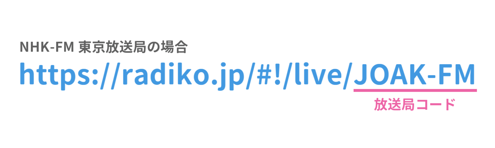

# Radicast

Radiko / NHKラジオ らじる★らじるの放送を HTTP による mp3 ストリーミングに変換します

## 使い方

### npx から使う

```bash
❯ radicast --help     
オプション:
      --help     ヘルプを表示                                                     [真偽]
      --version  バージョンを表示                                                   [真偽]
  -p, --port     HTTP server port number                      [数値] [デフォルト: 8080]
```

```bash
npx radicast
```

### グローバルインストールして使う

```bash
npm i -g radicast
radicast
```

## 各放送局へのパス

### `/nhk/:areaId/:stationId` - NHKラジオ らじる★らじる

- `areaId` - 放送局

|  areaId   |       放送局        |
| :-------: | :-----------------: |
|  sapporo  |  札幌放送局 (JOIK)  |
|  sendai   |  仙台放送局 (JOHK)  |
|   tokyo   |  東京放送局 (JOAK)  |
|  nagoya   | 名古屋放送局 (JOCK) |
|   osaka   |  大阪放送局 (JOBK)  |
| hiroshima |  広島放送局 (JOFK)  |
| matsuyama |  松山放送局 (JOZK)  |
|  fukuoka  |  福岡放送局 (JOLK)  |

- `stationId` - 放送種別

| stationId |    種別    |
| :-------: | :--------: |
|   r1hls   | ラジオ第一 |
|   r2hls   | ラジオ第二 |
|   fmhls   |   NHK-FM   |

### `/radiko/:stationId` - Radiko（周辺エリアのみ）

- `stationId` - 放送局コード

Radiko の各放送ページの URL から、各放送局のコードを確認することができます。



## Euro Truck Simulator 2 で使う

`radicast` を起動後、`live_streams.sii` 内に局リストを追加してください。

例：

- NHKラジオ第一 東京放送局
- NHKラジオ第二 東京放送局
- NHK-FM 東京放送局
- TOKYO FM
- J-WAVE
- NACK5

```text
SiiNunit
{
live_stream_def : _nameless.263.4698.8250 {
 stream_data: 194
 stream_data[0]: "http://localhost:8080/nhk/tokyo/r1hls|NHK Radio 1 Tokyo (JOAK)|Country|JP|0|0"
 stream_data[1]: "http://localhost:8080/nhk/tokyo/r2hls|NHK Radio 2 Tokyo (JOAB)|Education|JP|0|0"
 stream_data[2]: "http://localhost:8080/nhk/tokyo/fmhls|NHK-FM Tokyo (JOAK-FM)|Country|JP|0|0"
 stream_data[3]: "http://localhost:8080/radiko/FMT|TOKYO FM (JOAU-FM)||JP|0|0"
 stream_data[4]: "http://localhost:8080/radiko/FMJ|J-WAVE (JOAV-FM)|Music|JP|0|0"
 stream_data[5]: "http://localhost:8080/radiko/NACK5|NACK5 (JODV-FM)||JP|0|0"

 ...other stations...
}
}
```
